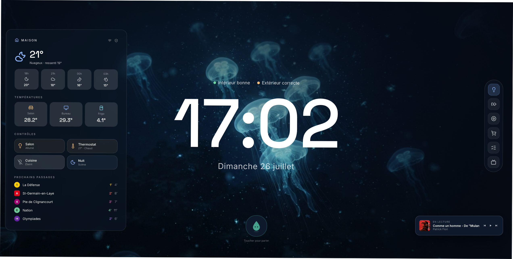
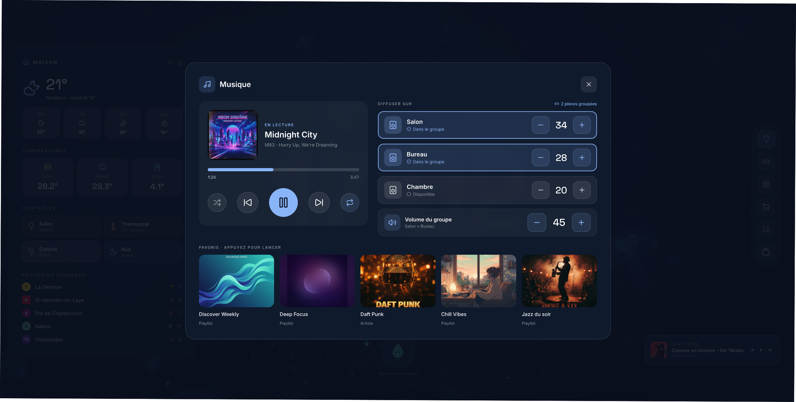
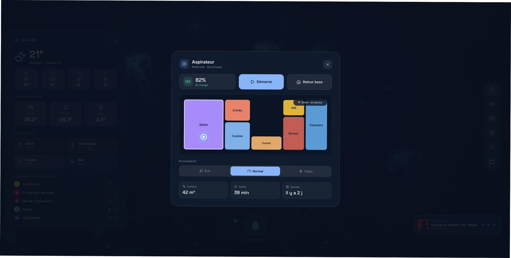
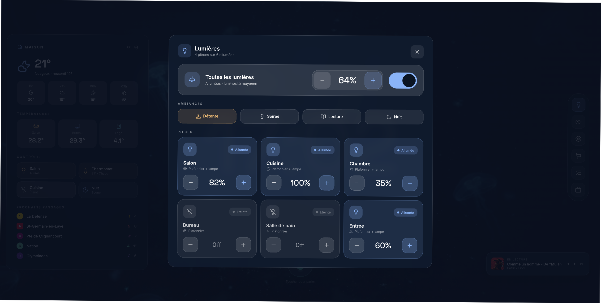
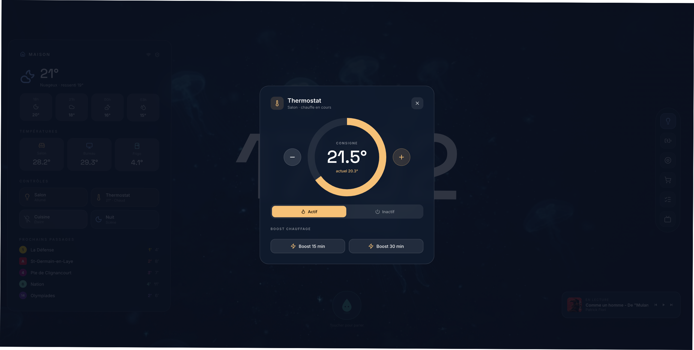

# Wall Tablet Dashboard for Home Assistant

A wall tablet dashboard built as **one plain web page**. No Lovelace, no cards,
no custom components, no build step: an `index.html`, a stylesheet, a handful
of JS modules, and a single config file. Everything talks to Home Assistant
locally over its WebSocket API, so every tap is instant.

> Shared as-is. This runs my home every day, but I make no promise of support,
> features or fixes. Fork away.



| | |
|---|---|
|  |  |
|  |  |

*Screenshots are from my own setup, which includes a couple of extras not in
this repo (a local transit section, and the little mascot). See the FAQ.*

## Why a plain page?

Lovelace is great at being a control panel you configure. This is the other
philosophy: a screen you **design**, pixel by pixel, that happens to control a
house. Smooth animations, full layout freedom, and one `config.js` where
everything about *your* home lives. The page is the UI; Home Assistant stays
the brain.

Anything a Lovelace dashboard can see or do, this page can too: Lovelace
itself is "just a website" running on the same WebSocket API. Helpers,
areas, devices, registries — all available.

## What's in the box

- **Info rail**: current weather and hourly forecast (Open-Meteo, no API key),
  room temperatures, touch shortcuts (lights, thermostat, scenes)
- **Big clock** with date, and an air-quality line (CO2) if you have a sensor
- **Panels** opened from a dock: lights with brightness sliders and scenes,
  batteries (auto-discovered via `device_class: battery`, nothing to list),
  vacuum with a floor plan drawn from three lines of config, two todo lists,
  and a music card with live Sonos favorites and their real artwork
  (discovered through `browse_media`, nothing hardcoded)
- **Sleep mode**: after some inactivity the page fades to black with just the
  clock. First touch wakes it without triggering the button underneath.
  Under Fully Kiosk, the hardware backlight is driven too.
- **Background slideshow** with a slow Ken Burns effect, from your own images
- **Version marker** in the rail, because a kiosk page that's already loaded
  never reloads by itself, and you want to know what's running

## Requirements

- Home Assistant reachable on your LAN
- A long-lived access token from a **dedicated, non-admin, local-only** user
  (Settings → People → add user, then log in as them and create the token
  from their profile). Do not use an admin token.
- Any way to serve a static folder. Simplest: drop the folder into HA's
  `www/`. Cleaner: any static server or reverse proxy on an always-on box.
- A tablet with a browser. [Fully Kiosk](https://www.fully-kiosk.com/) PLUS
  recommended: the page uses its JS API for hardware brightness.

## Quick start

1. Copy `config.exemple.js` to `config.js`
2. Fill it in: token, your entities, your coordinates, your wallpapers
3. Serve the folder, open it, done

### Or run it with Docker

```bash
cp config.exemple.js config.js   # then fill it in
docker compose up -d             # served on http://<host>:8080
```

The image is just nginx plus the static files; your `config.js` is mounted at
runtime and never baked in, since it contains your token.

**Optional but recommended: put a password on it.** Since `config.js` holds
your token, anyone on your LAN who can load the page can read it. To gate the
container behind basic auth:

```bash
htpasswd -cB .htpasswd tablet        # pick a password (or use an online bcrypt generator)
```

Then add these two mounts to `docker-compose.yml`:

```yaml
    volumes:
      - ./config.js:/usr/share/nginx/html/config.js:ro
      - ./.htpasswd:/etc/nginx/.htpasswd:ro
      - ./nginx-auth.conf:/etc/nginx/conf.d/default.conf:ro
```

with `nginx-auth.conf`:

```nginx
server {
  listen 80;
  root /usr/share/nginx/html;
  auth_basic "Dashboard";
  auth_basic_user_file /etc/nginx/.htpasswd;
}
```

Your browser and kiosk app will ask for the credentials once and remember
them (Fully Kiosk: Web Content Settings → Username/Password for HTTP Auth).

The config file is the only file you should need to touch. Comments in the
code are in French (the author is), but the code itself is small and plain.

## Security notes, please read

- The HA token lives in `config.js`, client-side. **Treat the page like a key
  to your house.** Use a dedicated non-admin user with "local access only"
  checked: even leaked, the token then can't manage HA and can't be used from
  outside your LAN.
- Never commit your real `config.js` (the `.gitignore` here already excludes
  it).
- Serve LAN-only. If you want HTTPS locally (required for anything using the
  microphone), the comfortable path is a reverse proxy with a DNS-01
  certificate: real cert, domain resolving to a LAN IP, zero open ports.
- Extra hardening that costs little: basic auth on the reverse proxy in front
  of the page files, and a separate wifi network for guests and IoT.

## FAQ

**Does it work with helpers?** Yes. Helpers are plain entities on the
WebSocket API: same `get_states`, same `state_changed`, and you write to them
through their services (`input_number.set_value`, etc.).

**Where's the voice assistant / the mascot?** Not included. The voice version
(OpenAI Realtime over WebRTC, with tools acting on the house) and the little
living mascot are more entangled with my own home; this repo is the dashboard
core. The architecture notes above tell you most of what you'd need.

**Why is the UI in French?** Because my living room is. All user-facing
strings live in `config.js` and `index.html`, translate at will.

## Credits

- Weather icons: [Meteocons](https://bas.dev/work/meteocons) by Bas Milius
  (MIT)
- Weather data: [Open-Meteo](https://open-meteo.com/)
- Built with the help of Claude Code, designed by a human with opinions

## Support

If this made your wall a little nicer and you feel like buying me a coffee
(my mascot would take a bath in it):
[ko-fi.com/nathanproductbuilder](https://ko-fi.com/nathanproductbuilder)

## License

MIT
